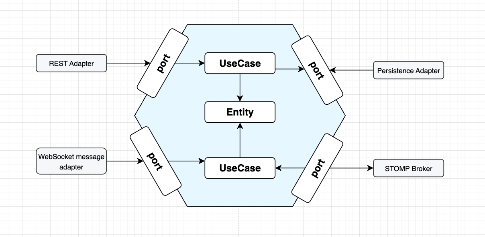

# Live Chat

A modern, real-time chat backend application designed to support private and group messaging, contact management, and
instant notifications. Built with Spring Boot and Java 21, the project follows a clean, hexagonal architecture (Ports
and Adapters), making it highly modular, maintainable, and suitable for integration into various platforms requiring
live communication features.

## Features

- **Real-Time Messaging**: Supports sending and receiving messages in both private (one-on-one) and group chats.
- **WebSocket Support**: Uses WebSockets for real-time message delivery and interaction between clients and the server.
- **STOMP Broker Integration**: Utilizes STOMP as a message broker over WebSockets to efficiently route messages between
  chat participants.
- **Contact Management**: Users can send, receive, and manage contact requests, and view their contact list.
- **Group Chat**: Create group chats and invite multiple users.
- **Event-Driven Notifications**: Utilizes Spring’s event system to send notifications for new messages, unread
  messages, and contact requests.
- **User Management**: Register, authenticate, and manage user accounts.
- **Secure API**: OAuth2 JWT-based authentication and stateless session management.
- **Extensible Architecture**: Decoupled notification system and clear separation of business logic layers.
- **Modern Java 21**: Leverages the latest features and performance improvements from Java 21.

## Hexagonal Architecture (Ports & Adapters)

This project is structured following the **hexagonal (clean) architecture** principles:

- **Core Domain**: Contains business logic, use cases, and domain models, isolated from infrastructure concerns.
- **Ports (Interfaces)**: Define the operations required by the core, such as repositories and notification services.
- **Adapters**: Implement the ports for technologies like databases, REST APIs, WebSockets, security, and event
  publishing.
- **Benefits**: This separation ensures high testability, flexibility to change frameworks or infrastructure, and easy
  maintenance.



## Technologies

- Java 21
- Spring Boot
- Spring Data JPA
- Spring Security (OAuth2, JWT)
- PostgreSQL
- WebSockets (with STOMP message broker)
- Event-driven architecture (Spring Events)
- RESTful API

## Getting Started

### Prerequisites

- Java 21
- Maven
- PostgreSQL database
- (Optional) Docker for containerized deployment

### Setup

1. **Clone the repository:**

   ```bash
   git clone https://github.com/thalesmaiaa/live-chat.git
   cd live-chat
   ```

2. **Configure the application:**

    - Update `src/main/resources/application.yml` with your PostgreSQL database and security settings. Example
      configuration:
      ```yaml
      spring:
        datasource:
          url: jdbc:postgresql://localhost:5432/livechatdb
          username:
          password:
      ```

3. **Build the project:**

   ```bash
   ./mvnw clean install
   ```

4. **Run the application:**
   ```bash
   ./mvnw spring-boot:run
   ```

### API Usage

#### Authentication

- Register a user: `POST /users`
- Login: `POST /oauth/login` (returns JWT)

#### Chat Endpoints

- Create group chat: `POST /chats`
- Create private chat: `POST /chats/{senderId}`
- Get all user chats: `GET /chats`
- Get chat by ID: `GET /chats/{chatId}`

#### Contact Endpoints

- Send contact request: `POST /contacts`
- Accept/Reject request: `PATCH /contacts/{contactId}/{status}`
- List contacts: `GET /contacts`
- List pending invites: `GET /contacts/invites`

#### Messaging

- Messages are sent as part of chat creation or via chat endpoints; notifications are automatically generated and
  delivered via the event system.
- Real-time message exchange is handled via WebSockets with STOMP as the message broker.

### WebSockets & Real-Time Messaging

- The application exposes WebSocket endpoints for clients to subscribe and send messages in real time.
- **STOMP Broker**: Acts as the message routing layer, managing subscriptions and message delivery.
- Clients connect to WebSocket endpoints and subscribe to topics or queues for chat updates, ensuring instant message
  delivery and efficient communication.

### Event-Driven Notifications

- Uses Spring's `ApplicationEventPublisher` to emit notification events.
- `NotificationEventListener` handles delivery and processing, decoupling notification logic from core business flows.
- Notifications can be pushed to users via WebSockets, push notification services, or other mechanisms.

## Project Structure

- `adapter/in/` - REST controllers (API endpoints)
- `adapter/out/` - Persistence adapters (repositories, external services)
- `core/domain/` - Core business entities and value objects
- `core/usecase/` - Application business logic (use cases)
- `core/events/` - Event classes and listeners
- `config/` - Security and application configuration

## Contributing

Contributions are welcome! Please fork the repository and submit a pull request with your proposed changes.

**Author:** [@thalesmaiaa](https://github.com/thalesmaiaa)
