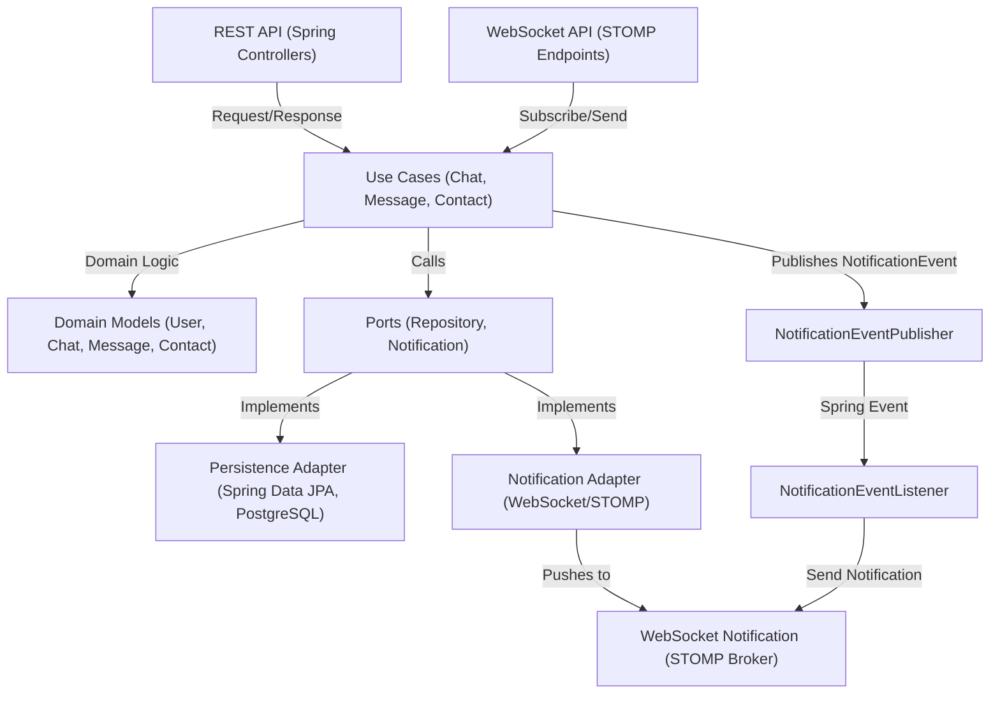

## Architecture & Functionalities Diagram

Below is a high-level diagram illustrating the main components and flow of the Live Chat application, highlighting its
hexagonal structure, REST and WebSocket interfaces, and event-driven notification system.

**Legend:**

- **REST API**: Handles HTTP requests (user, chat, contact management)
- **WebSocket API**: Handles real-time message delivery via STOMP
- **Use Cases**: Application business logic (chat, message, contact operations)
- **Domain Models**: Core business entities
- **Ports**: Interfaces for persistence and notification
- **Adapters**: Implementations of ports (e.g., database, WebSocket/STOMP)
- **Notification System**: Event-driven notification processing and delivery

This architecture ensures clear separation of concerns, real-time communication, and a flexible, testable codebase.